# Call Flow Node Reference & Taxonomy

This reference guide documents all **34 Node Types** available in the Call Flow Studio. It is designed to act as a **visual mindmap and detailed dictionary**, allowing developers and designers to quickly understand the purpose, inputs/outputs, and inspector properties of every node.

---

## 1. Visual Taxonomy (Mindmap)

This tree diagram maps the full hierarchy of Call Flow nodes, categorized by their structural roles in the system.

```mermaid
graph LR
    %% Category Nodes
    root[Call Flow Node Library] ---> cat_entry[1. Entry Points]
    root ---> cat_menu[2. Menus]
    root ---> cat_action[3. Menu Actions]
    root ---> cat_answering[4. Answering Modes]
    root ---> cat_forwarding[5. Forwarding]
    root ---> cat_screening[6. Screening]
    root ---> cat_condition[7. Conditions]
    root ---> cat_messaging[8. Messaging]
    root ---> cat_recording[9. Recording]
    root ---> cat_target[10. Targets]
    root ---> cat_terminal[11. Terminals]

    %% Entry Points
    cat_entry --> incoming_call["Incoming Call<br>(incoming_call)"]
    cat_entry --> outgoing_call["Outgoing Call<br>(outgoing_call)"]

    %% Menus
    cat_menu --> menu_root["ROOT Menu<br>(menu_root)"]
    cat_menu --> menu_custom["Custom Menu<br>(menu_custom)"]

    %% Menu Actions
    cat_action --> action_transfer["Transfer<br>(action_transfer)"]
    cat_action --> action_prompt_ext["Prompt for Extension<br>(action_prompt_extension)"]
    cat_action --> action_dial_direct["Dial Extension Directly<br>(action_dial_direct)"]
    cat_action --> action_voicemail["Voicemail Transfer<br>(action_voicemail)"]
    cat_action --> action_dial_name["Dial-by-Name<br>(action_dial_by_name)"]
    cat_action --> action_disconnect["Disconnect<br>(action_disconnect)"]
    cat_action --> action_disa["DISA<br>(action_disa)"]
    cat_action --> action_queue["Call Queue<br>(action_queue)"]
    cat_action --> action_nop["Do Nothing<br>(action_nop)"]

    %% Answering Modes
    cat_answering --> answering_mode_ext["Answering Mode - Ext<br>(answering_mode_ext)"]
    cat_answering --> answering_mode_aa["Answering Mode - AA<br>(answering_mode_aa)"]

    %% Forwarding
    cat_forwarding --> forward_follow_me["Follow-me<br>(forward_follow_me)"]
    cat_forwarding --> forward_advanced["Advanced Forwarding<br>(forward_advanced)"]
    cat_forwarding --> forward_sip_uri["Forward to SIP URI<br>(forward_sip_uri)"]
    cat_forwarding --> forward_simple["Simple Forwarding<br>(forward_simple)"]

    %% Screening
    cat_screening --> screening_rule["Screening Rule<br>(screening_rule)"]

    %% Conditions
    cat_condition --> cond_time["Time Check<br>(cond_time)"]
    cat_condition --> cond_caller["Caller Check<br>(cond_caller)"]
    cat_condition --> cond_callee["Callee Check<br>(cond_callee)"]
    cat_condition --> cond_mode["Mode Check<br>(cond_mode)"]

    %% Messaging
    cat_messaging --> voicemail["Voicemail Box<br>(voicemail)"]
    cat_messaging --> fax_mailbox["Fax Mailbox<br>(fax_mailbox)"]

    %% Recording
    cat_recording --> call_recording["Call Recording<br>(call_recording)"]

    %% Targets
    cat_target --> target_extension["Extension<br>(target_extension)"]
    cat_target --> target_hunt["Hunt Group<br>(target_hunt_group_ref)"]
    cat_target --> target_external["External Number<br>(target_external)"]
    cat_target --> target_sip["SIP URI<br>(target_sip_uri)"]

    %% Terminals
    cat_terminal --> term_answered["Answered<br>(term_answered)"]
    cat_terminal --> term_voicemail_left["Voicemail Left<br>(term_voicemail_left)"]
    cat_terminal --> term_fwd_ans["Forwarded-Answered<br>(term_forwarded_answered)"]
    cat_terminal --> term_fwd_unans["Forwarded-Unanswered<br>(term_forwarded_unanswered)"]
    cat_terminal --> term_rejected["Rejected<br>(term_rejected)"]
    cat_terminal --> term_dropped["Dropped<br>(term_dropped)"]

    %% Styles for Categories
    style cat_entry fill:#3a86ff,stroke:#111,stroke-width:1px,color:#fff
    style cat_menu fill:#9d4edd,stroke:#111,stroke-width:1px,color:#fff
    style cat_action fill:#f4a261,stroke:#111,stroke-width:1px,color:#111
    style cat_answering fill:#ffb454,stroke:#111,stroke-width:1px,color:#111
    style cat_forwarding fill:#06d6a0,stroke:#111,stroke-width:1px,color:#111
    style cat_screening fill:#ef476f,stroke:#111,stroke-width:1px,color:#fff
    style cat_condition fill:#ffd166,stroke:#111,stroke-width:1px,color:#111
    style cat_messaging fill:#8ecae6,stroke:#111,stroke-width:1px,color:#111
    style cat_recording fill:#f75e9d,stroke:#111,stroke-width:1px,color:#fff
    style cat_target fill:#5fa8d3,stroke:#111,stroke-width:1px,color:#fff
    style cat_terminal fill:#adb5bd,stroke:#111,stroke-width:1px,color:#111
```



---

## 2. Category Anatomy & Visual Design

The Call Flow Studio assigns distinct aesthetic characteristics (colors, icons, and port configurations) to each category to make flows instantly readable at a distance.

| Category | Primary Color | Default Ports | Primary Focus | Lucide Icon Representation |
| :--- | :--- | :--- | :--- | :--- |
| **1. Entry Points** | `#3a86ff` (Blue) | No input, Output: `next` | Start of flow | `PhoneIncoming` (Inbound), `PhoneOutgoing` (Outbound) |
| **2. Menus** | `#9d4edd` (Purple) | Input: `in`, Output: `next` | DTMF IVR branching | `FolderTree` (Root), `Menu` (Custom sub-menu) |
| **3. Menu Actions** | `#f4a261` (Orange) | Input: `in`, Output: `next`/None | Individual key behavior | `PhoneForwarded`, `Hash`, `Voicemail`, `PhoneOff`, `Ban` |
| **4. Answering Modes** | `#ffb454` (Yellowish) | Input: `in`, Multi-port exits | Answering flow selector | `ToggleLeft` (Extension), `Sliders` (Auto Attendant) |
| **5. Forwarding** | `#06d6a0` (Green) | Input: `in`, Output: `answered`/`unanswered` | External/Internal redirecting | `Shuffle`, `GitFork`, `Globe`, `ArrowRight` |
| **6. Screening** | `#ef476f` (Red) | Input: `in`, Output: `matched`/`next_rule` | Anti-spam or custom routing | `Filter` |
| **7. Conditions** | `#ffd166` (Yellow) | Input: `in`, Output: `true`/`false` | Binary boolean branching | `Clock`, `UserCheck`, `CheckSquare`, `Activity` |
| **8. Messaging** | `#8ecae6` (Light Blue) | Input: `in`, Output: `done` | Recording messages & faxes | `Voicemail`, `Printer` |
| **9. Recording** | `#f75e9d` (Pink) | Input: `in`, Output: `done` | Call recording options | `Mic` |
| **10. Targets** | `#5fa8d3` (Steel Blue) | Input: `in`, No outputs | Final routing endpoints | `User`, `Users`, `ExternalLink`, `Mail` |
| **11. Terminals** | `#adb5bd` (Grey) | Input: `in`, No outputs | Visual state termination | `PhoneCall`, `MailCheck`, `Ban`, `XCircle` |

---

## 3. Node Specification & Inspector Details

Below is the exhaustive specification of every node, organized by category.

### Category 1: Entry Points (`entry`)

These nodes represent the beginning of a Call Flow. They do not have input ports.

#### 1. Incoming Call (`incoming_call`)
*   **Description**: Entry point representing an inbound call arriving at the designated account or DID.
*   **Ports**:
    *   *Inputs*: None
    *   *Outputs*: `next` (triggers the answering rule chain)
*   **Default JSON**:
    ```json
    { "label": "Incoming Call" }
    ```
*   **Inspector Fields**:
    | Field Key | Label | Type | Validation / Constraints | Description / Help Text |
    | :--- | :--- | :--- | :--- | :--- |
    | `label` | Label | `text` | Required | Friendly label displayed on the node card header. |
    | `did` | DID | `text` | E.164 format (optional) | The primary dialed number (Direct Inward Dialing) for this entry. |

#### 2. Outgoing Call (`outgoing_call`)
*   **Description**: Entry point representing an outbound call initiated by this extension or account. Controls screening, call recording, and bar groups.
*   **Ports**:
    *   *Inputs*: None
    *   *Outputs*: `next`
*   **Default JSON**:
    ```json
    {
      "label": "Outgoing Call",
      "barred_categories": [],
      "record": false,
      "unblock_code_required": false
    }
    ```
*   **Inspector Fields**:
    | Field Key | Label | Type | Validation / Constraints | Description / Help Text |
    | :--- | :--- | :--- | :--- | :--- |
    | `label` | Label | `text` | Required | Friendly label on the node card header. |
    | `record` | Record calls | `toggle` | Boolean | Activates immediate recording of outbound legs. |
    | `record_announce_prompt` | Announcement prompt | `text` | Optional string | Audio prompt ID played to warn call parties of recording. |
    | `record_send_to_email` | Send to email | `email` | Valid email address | Delivers the recorded audio package to this address on disconnect. |
    | `unblock_code_required` | Require unblock code (IVR) | `toggle` | Boolean | When true, prompts caller for a PIN before enabling outbound dialing. |

---

### Category 2: Menus (`menu`)

Menus branch calls based on the caller entering single DTMF digits (0-9, *, #) during an announcement.

#### 1. ROOT Menu (`menu_root`)
*   **Description**: The mandatory root IVR menu for an Auto Attendant. Locked to `ROOT` name, but fully configurable. Cannot be deleted or created from the palette.
*   **Ports**:
    *   *Inputs*: `in`
    *   *Outputs*: `next` (Default fallback / escape route)
*   **Default JSON**:
    ```json
    {
      "name": "ROOT",
      "active_period": "always",
      "no_input": { "timeout_s": 9 },
      "allow_direct_dial": false,
      "interdigit_timeout_s": 5,
      "actions": {}
    }
    ```
*   **Inspector Fields (Tab Grouped)**:
    *   **Tab: General**
        | Field Key | Label | Type | Validation / Constraints | Description / Help Text |
        | :--- | :--- | :--- | :--- | :--- |
        | `name` | Name | `readonly` | Locked to `"ROOT"` | Fixed name for the root IVR. |
        | `active_period` | Active period | `active-period` | `always` or custom interval | The schedule when this menu is online. |
        | `allow_direct_dial` | Allow direct extension dial | `toggle` | Boolean | Enables callers to type an extension (e.g. 104) directly. |
        | `interdigit_timeout_s` | Interdigit timeout (s) | `number` | Min: 1, Max: 30 (Hidden inline) | Wait window between keystrokes when direct dialing is active. |
    *   **Tab: Prompts**
        | Field Key | Label | Type | Validation / Constraints | Description / Help Text |
        | :--- | :--- | :--- | :--- | :--- |
        | `intro_prompt` | Intro prompt | `text` | Optional prompt ID | Played once upon menu entry (e.g. "Thank you for calling Acme"). |
        | `menu_prompt` | Menu prompt | `text` | Optional prompt ID | Played on entry and retries (e.g. "Press 1 for Sales, 2 for Support"). |
    *   **Tab: Actions**
        | Field Key | Label | Type | Validation / Constraints | Description / Help Text |
        | :--- | :--- | :--- | :--- | :--- |
        | `actions` | Menu actions | `actions-map` | DTMF keys mapped to targets | Visual canvas connections representing DTMF keys (0-9, *, #). |
    *   **Tab: Errors**
        | Field Key | Label | Type | Validation / Constraints | Description / Help Text |
        | :--- | :--- | :--- | :--- | :--- |
        | `no_input.timeout_s` | No-input timeout (s) | `number` | Min: 1, Max: 60 | Silence timeout duration before triggering the fallback node. |
        | `max_input_errors` | Max input errors | `number` | Min: 1, Max: 10 | Maximum permitted invalid key attempts or timeouts. |
        | `on_timeout_prompt` | On-timeout prompt | `text` | Optional prompt ID | Played when the caller does not press any key within the timeout. |
        | `on_unavailable_prompt`| On-unavailable prompt | `text` | Optional prompt ID | Played when a caller dials an unavailable extension. |
        | `max_fails_prompt` | Max-fails prompt | `text` | Optional prompt ID | Played immediately before disconnecting after max error threshold. |

#### 2. Custom Menu (`menu_custom`)
*   **Description**: A user-defined sub-menu representing nested levels of the IVR hierarchy.
*   **Ports**:
    *   *Inputs*: `in`
    *   *Outputs*: `next`
*   **Default JSON**: Same as `menu_root` but `name` defaults to `"Menu"`.
*   **Inspector Fields**: Same as `menu_root`, except the **Name** field is editable:
    | Field Key | Label | Type | Validation / Constraints | Description / Help Text |
    | :--- | :--- | :--- | :--- | :--- |
    | `name` | Name | `text` | Required, non-empty | Descriptive name of this nested sub-menu. |

---

### Category 3: Menu Actions (`action`)

These nodes are connected to Menu output terminals. They define what happens when a specific key is pressed.

#### 1. Transfer (`action_transfer`)
*   **Description**: Routes the call to either an internal target (extension, hunt group) or executes an external call to an E.164 phone number.
*   **Ports**:
    *   *Inputs*: `in`
    *   *Outputs*: `next`
*   **Default JSON**:
    ```json
    { "mode": "extension" }
    ```
*   **Inspector Fields**:
    | Field Key | Label | Type | Validation / Constraints | Description / Help Text |
    | :--- | :--- | :--- | :--- | :--- |
    | `mode` | Transfer to | `select` | `["extension", "e164"]` | **extension**: Routes internally to a target node.<br>**e164**: Dials out to an external public telephone number. |
    | `target_node_id` | Target node id | `text` | (Hidden inline) | Read-only ID of the target extension. Set by drawing a canvas edge. |
    | `number` | E.164 number | `text` | E.164 (Visible only when mode is `e164`) | Public destination number (e.g. `+18005551234`). |
    | `play_before_action` | Play before action | `text` | Optional prompt ID | Announcement played to the caller before routing begins. |

#### 2. Prompt for Extension (`action_prompt_extension`)
*   **Description**: Play a prompt requesting a full extension number, then wait for caller entry.
*   **Ports**:
    *   *Inputs*: `in`
    *   *Outputs*: `next`
*   **Default JSON**:
    ```json
    { "timeout_s": 5 }
    ```
*   **Inspector Fields**:
    | Field Key | Label | Type | Validation / Constraints | Description / Help Text |
    | :--- | :--- | :--- | :--- | :--- |
    | `prompt` | Prompt | `text` | Optional prompt ID | Greeting asking for the extension (e.g., "Enter the extension number"). |
    | `timeout_s` | Timeout (s) | `number` | Min: 1, Max: 30 | Seconds to wait for entry. |
    | `max_digits` | Max digits | `number` | Min: 1, Max: 10 | Upper limit of digits caller can enter (PortaOne "Max Size"). |

#### 3. Dial Extension Directly (`action_dial_direct`)
*   **Description**: Initiated when the first pressed digit is recognized as the starting number of an extension; this action waits to capture the remaining digits.
*   **Ports**:
    *   *Inputs*: `in`
    *   *Outputs*: `next`
*   **Default JSON**: `{}`
*   **Inspector Fields**:
    | Field Key | Label | Type | Validation / Constraints | Description / Help Text |
    | :--- | :--- | :--- | :--- | :--- |
    | `first_digit` | First digit | `select` | `["0"-"9"]` | The key that triggered this dial direct block. |
    | `max_digits` | Max digits | `number` | Min: 1, Max: 10 | Total extension digits expected (including the first digit). |

#### 4. Transfer to Voicemail (`action_voicemail`)
*   **Description**: Sends the caller straight to a specific voicemail box node.
*   **Ports**:
    *   *Inputs*: `in`
    *   *Outputs*: `next`
*   **Default JSON**: `{}`
*   **Inspector Fields**:
    | Field Key | Label | Type | Validation / Constraints | Description / Help Text |
    | :--- | :--- | :--- | :--- | :--- |
    | `mailbox_node_id` | Mailbox node ID | `text` | Hidden (Set via edge) | Target voicemail node ID. |
    | `play_before_action` | Play before action | `text` | Optional prompt ID | Audio to play before dropping the call into the mailbox. |

#### 5. Dial-by-Name (`action_dial_by_name`)
*   **Description**: Directs callers to input DTMF letters matching the first three characters of a user's name to find their extension.
*   **Ports**:
    *   *Inputs*: `in`
    *   *Outputs*: `next`
*   **Default JSON**: `{}`
*   **Inspector Fields**:
    | Field Key | Label | Type | Validation / Constraints | Description / Help Text |
    | :--- | :--- | :--- | :--- | :--- |
    | `prompt` | Prompt | `text` | Optional prompt ID | Prompt explaining instructions (e.g., "Spell the name of the person..."). |
    | `announce_extensions` | Announce extension numbers | `toggle` | Boolean | If true, the system announces the found extension number before transferring. |

#### 6. Disconnect (`action_disconnect`)
*   **Description**: Ends the call. Safe termination step for menu loops.
*   **Ports**:
    *   *Inputs*: `in`
    *   *Outputs*: None (Terminal Action)
*   **Default JSON**: `{}`
*   **Inspector Fields**:
    | Field Key | Label | Type | Validation / Constraints | Description / Help Text |
    | :--- | :--- | :--- | :--- | :--- |
    | `play_before_action` | Play before action | `text` | Optional prompt ID | Final farewell prompt (e.g. "Goodbye") played before line drop. |

#### 7. DISA (`action_disa`)
*   **Description**: Direct Inward System Access. Prompts for a passcode; upon authorization, grants caller an outbound dial tone from the PBX.
*   **Ports**:
    *   *Inputs*: `in`
    *   *Outputs*: `next`
*   **Default JSON**: `{}`
*   **Inspector Fields**:
    | Field Key | Label | Type | Validation / Constraints | Description / Help Text |
    | :--- | :--- | :--- | :--- | :--- |
    | `password_prompt` | Password prompt | `text` | Optional prompt ID | Played on entry (e.g. "Please enter your security access code"). |

#### 8. Call Queue (`action_queue`)
*   **Description**: Places the caller in a call queue queue wait state.
*   **Ports**:
    *   *Inputs*: `in`
    *   *Outputs*: `next`
*   **Default JSON**: `{}`
*   **Inspector Fields**:
    | Field Key | Label | Type | Validation / Constraints | Description / Help Text |
    | :--- | :--- | :--- | :--- | :--- |
    | `queue_name` | Queue name | `text` | Required | Name or identifier of the call distribution queue. |

#### 9. Do Nothing (`action_nop`)
*   **Description**: Intentionally passive option. Consumes the keypress, optionally plays an audio file, and returns the caller to the parent menu. Perfect for reserving dial plan keys.
*   **Ports**:
    *   *Inputs*: `in`
    *   *Outputs*: None
*   **Default JSON**: `{}`
*   **Inspector Fields**:
    | Field Key | Label | Type | Validation / Constraints | Description / Help Text |
    | :--- | :--- | :--- | :--- | :--- |
    | `prompt` | Optional prompt | `text` | Optional prompt ID | Explanatory clip (e.g. "This option is currently inactive"). |

---

### Category 4: Answering Modes (`answering`)

Answering modes decide how calls arriving at the primary DID are triaged (e.g., ring immediate, go to voicemail, or forward).

#### 1. Answering Mode (Extension) (`answering_mode_ext`)
*   **Description**: Primary incoming router for physical phone extensions.
*   **Ports**:
    *   *Inputs*: `in`
    *   *Outputs*: `ring`, `forward`, `voicemail`, `answered`, `unanswered`, `rejected`
*   **Default JSON**:
    ```json
    {
      "mode": "ring_only",
      "ring_timeout_s": 20,
      "reject_sip_code": 486
    }
    ```
*   **Inspector Fields**:
    | Field Key | Label | Type | Validation / Constraints | Description / Help Text |
    | :--- | :--- | :--- | :--- | :--- |
    | `mode` | Mode | `select` | `["ring_only", "voicemail_only", "forward_only", "ring_then_voicemail", ...]` | Combination logic that dictates which exit ports are activated during execution. |
    | `ring_timeout_s` | Ring timeout (s) | `number` | Min: 1, Max: 120 | Ringing duration before failing over to voicemail/forwarding. |
    | `reject_sip_code` | Reject SIP code | `number` | Min: 400, Max: 699 | SIP status returned if rejected (e.g. `486 Busy`, `603 Decline`). |

#### 2. Answering Mode (Auto Attendant) (`answering_mode_aa`)
*   **Description**: Primary incoming router for DIDs assigned to interactive voice systems.
*   **Ports**:
    *   *Inputs*: `in`
    *   *Outputs*: `ring`, `forward`, `ivr`, `answered`, `unanswered`, `rejected`
*   **Default JSON**:
    ```json
    {
      "mode": "ivr_only",
      "ring_timeout_s": 20,
      "reject_sip_code": 486
    }
    ```
*   **Inspector Fields**: Same as `answering_mode_ext`, except **Mode** options include `ivr` actions:
    | Field Key | Label | Type | Validation / Constraints | Description / Help Text |
    | :--- | :--- | :--- | :--- | :--- |
    | `mode` | Mode | `select` | `["ivr_only", "ring_then_ivr", "forward_then_ivr", "ring_forward_ivr", ...]` | Triage options supporting handoff to menus. |

---

### Category 5: Forwarding (`forwarding`)

Forwarding nodes route calls to off-premise numbers, additional extensions, or cascading rule groups.

#### 1. Follow-me (`forward_follow_me`)
*   **Description**: Escalates a call sequentially or simultaneously through a custom ordered rule list.
*   **Ports**:
    *   *Inputs*: `in`
    *   *Outputs*: `answered`, `unanswered`
*   **Default JSON**:
    ```json
    {
      "ring_mode": "sequential",
      "rules": [],
      "replace_caller_id_name": false
    }
    ```
*   **Inspector Fields**:
    | Field Key | Label | Type | Validation / Constraints | Description / Help Text |
    | :--- | :--- | :--- | :--- | :--- |
    | `ring_mode` | Ring mode | `select` | `["sequential", "simultaneous", "random", "percentage"]` | Rules execution style. |
    | `replace_caller_id_name`| Replace caller display name | `toggle` | Boolean | Prepends forwarder metadata to caller ID. |
    | `rules` | Forwarding rules | `rules-list` | Complex array of rules | List of internal/external target nodes with individual timeouts and schedules. |

#### 2. Advanced Forwarding (`forward_advanced`)
*   **Description**: Heavyweight version of Follow-Me that adds per-rule proxy routing and CLI manipulation.
*   **Ports**:
    *   *Inputs*: `in`
    *   *Outputs*: `answered`, `unanswered`
*   **Default JSON**: Same as `forward_follow_me` but includes `"keep_original_cld": false`.
*   **Inspector Fields**: Same as `forward_follow_me` plus:
    | Field Key | Label | Type | Validation / Constraints | Description / Help Text |
    | :--- | :--- | :--- | :--- | :--- |
    | `keep_original_cld` | Keep Original CLD | `toggle` | Boolean | Preserves the originally dialed number in the To header. |

#### 3. Forward to SIP URI (`forward_sip_uri`)
*   **Description**: Routes calls directly to a raw SIP endpoint address.
*   **Ports**:
    *   *Inputs*: `in`
    *   *Outputs*: `answered`, `unanswered`
*   **Default JSON**:
    ```json
    { "timeout_s": 20 }
    ```
*   **Inspector Fields**:
    | Field Key | Label | Type | Validation / Constraints | Description / Help Text |
    | :--- | :--- | :--- | :--- | :--- |
    | `target_uri` | Target URI | `text` | Valid format (e.g. `sip:bob@proxy.com`) | Target destination URI. |
    | `sip_proxy` | SIP proxy | `text` | Optional host/IP | Gateway address to proxy the connection. |
    | `timeout_s` | Timeout (s) | `number` | Min: 1, Max: 120 | ringing timeout. |

#### 4. Simple Forwarding (`forward_simple`)
*   **Description**: Routes the call directly to a single external E.164 number or a specific internal extension.
*   **Ports**:
    *   *Inputs*: `in`
    *   *Outputs*: `answered`, `unanswered`
*   **Default JSON**:
    ```json
    { "timeout_s": 20 }
    ```
*   **Inspector Fields**:
    | Field Key | Label | Type | Validation / Constraints | Description / Help Text |
    | :--- | :--- | :--- | :--- | :--- |
    | `target_number` | Target | `text` | Valid number or extension | Phone number or extension target. |
    | `timeout_s` | Timeout (s) | `number` | Min: 1, Max: 120 | Ringing duration before failover. |

---

### Category 6: Screening (`screening`)

Screening rules act as inline gates, matching details of incoming call legs to filter spam or redirect key clients.

#### 1. Screening Rule (`screening_rule`)
*   **Description**: Inline rule with matching filters. First match triggers the designated action mode; non-matches route to the next rule in sequence.
*   **Ports**:
    *   *Inputs*: `in`
    *   *Outputs*: `matched`, `next_rule`
*   **Default JSON**:
    ```json
    {
      "name": "Rule",
      "order": 0,
      "enabled": true,
      "conditions": {
        "time_period": "always",
        "caller": { "kind": "any" },
        "callee": { "kind": "any" }
      },
      "action_mode": "voicemail_only"
    }
    ```
*   **Inspector Fields**:
    | Field Key | Label | Type | Validation / Constraints | Description / Help Text |
    | :--- | :--- | :--- | :--- | :--- |
    | `name` | Rule name | `text` | Required | Descriptive identifier. |
    | `order` | Order | `number` | Min: 0 | Execution sequence priority. |
    | `enabled` | Enabled | `toggle` | Boolean | Toggles active evaluation status. |
    | `conditions.time_period`| Time period | `active-period` | `always` or custom interval | Evaluates rule match under specific schedules. |
    | `conditions.caller.kind`| Caller check | `select` | `["any", "number", "prefix", "regex", "anonymous", "caller_list"]` | Selector type for matching the incoming Caller ID. |
    | `conditions.caller.value`| Caller value | `text` | Optional string | Matches caller number, prefix digits, or regex pattern. |
    | `conditions.callee.kind`| Callee check | `select` | `["any", "did", "alias"]` | Selector type for matching target callee DID. |
    | `conditions.callee.value`| Callee value | `text` | Optional string | Specific DID number or alias. |
    | `action_mode` | Action mode | `select` | Same options as `answering_mode_ext` | Resulting triage action when condition is fully matched. |
    | `play_before_action` | Play before action | `text` | Optional prompt ID | Prompt played prior to matched routing execution. |

---

### Category 7: Conditions (`condition`)

Conditions run logical checks on the current call state to split execution paths. They always expose `true` and `false` exit ports.

#### 1. Time Check (`cond_time`)
*   **Description**: Evaluates if the current system time falls within a named schedule.
*   **Ports**:
    *   *Inputs*: `in`
    *   *Outputs*: `true` (within period), `false` (outside period)
*   **Default JSON**:
    ```json
    { "period": "always" }
    ```
*   **Inspector Fields**:
    | Field Key | Label | Type | Validation / Constraints | Description / Help Text |
    | :--- | :--- | :--- | :--- | :--- |
    | `period` | Time period | `active-period` | Required | Schedule profile to evaluate (e.g. `business_hours`, `holidays`). |

#### 2. Caller Check (`cond_caller`)
*   **Description**: Branches the flow based on a match with the caller's phone number or ID category.
*   **Ports**:
    *   *Inputs*: `in`
    *   *Outputs*: `true` (matches), `false` (does not match)
*   **Default JSON**:
    ```json
    { "kind": "number" }
    ```
*   **Inspector Fields**:
    | Field Key | Label | Type | Validation / Constraints | Description / Help Text |
    | :--- | :--- | :--- | :--- | :--- |
    | `kind` | Kind | `select` | `["number", "prefix", "regex", "anonymous", "caller_list"]` | Matching rule category. |
    | `value` | Value | `text` | Required | Number literal, prefix digits, or regex pattern string. |

#### 3. Callee Check (`cond_callee`)
*   **Description**: Branches flow depending on which specific DID or alias was dialed by the inbound caller.
*   **Ports**:
    *   *Inputs*: `in`
    *   *Outputs*: `true`, `false`
*   **Default JSON**:
    ```json
    { "kind": "did" }
    ```
*   **Inspector Fields**:
    | Field Key | Label | Type | Validation / Constraints | Description / Help Text |
    | :--- | :--- | :--- | :--- | :--- |
    | `kind` | Kind | `select` | `["did", "alias"]` | Target destination matching category. |
    | `value` | Value | `text` | Required | The literal DID or alias address to match against. |

#### 4. Mode Check (`cond_mode`)
*   **Description**: Branches flow based on the currently active PBX profile state (e.g. holiday override mode).
*   **Ports**:
    *   *Inputs*: `in`
    *   *Outputs*: `true`, `false`
*   **Default JSON**:
    ```json
    { "mode": "business_hours" }
    ```
*   **Inspector Fields**:
    | Field Key | Label | Type | Validation / Constraints | Description / Help Text |
    | :--- | :--- | :--- | :--- | :--- |
    | `mode` | Mode | `text` | Required (Placeholder: `business_hours`) | The text token identifying the active profile state to match. |

---

### Category 8: Messaging (`messaging`)

Messaging nodes manage physical voicemail drops and digital fax storage.

#### 1. Voicemail Box (`voicemail`)
*   **Description**: Records a caller voice message. Integrates PIN verification and automated email delivery formats.
*   **Ports**:
    *   *Inputs*: `in`
    *   *Outputs*: `done` (triggers when caller hangs up after leaving message)
*   **Default JSON**:
    ```json
    {
      "greeting": "standard",
      "require_pin": true,
      "auto_play": false,
      "announce_datetime": true,
      "email_option": "none"
    }
    ```
*   **Inspector Fields**:
    | Field Key | Label | Type | Validation / Constraints | Description / Help Text |
    | :--- | :--- | :--- | :--- | :--- |
    | `greeting` | Greeting | `select` | `["standard", "personal", "name", "extended_absence"]` | Voice recording mode played to greeting callers. |
    | `require_pin` | Require PIN | `toggle` | Boolean | Demands password validation when checking messages by phone. |
    | `auto_play` | Auto-play on login | `toggle` | Boolean | Instantly starts playback of new files upon mailbox login. |
    | `announce_datetime`| Announce date/time | `toggle` | Boolean | Prepends timestamp metadata playback to every voice message. |
    | `email_option` | Email option | `select` | `["none", "forward", "forward_as_attachment", "copy", "notify"]` | Notification mode for sending media assets to emails. |
    | `email_address` | Email address | `email` | Valid email address | Targets address for deliveries. |

#### 2. Fax Mailbox (`fax_mailbox`)
*   **Description**: Stores and delivers incoming fax transmissions.
*   **Ports**:
    *   *Inputs*: `in`
    *   *Outputs*: `done`
*   **Default JSON**:
    ```json
    { "email_option": "forward_as_attachment" }
    ```
*   **Inspector Fields**:
    | Field Key | Label | Type | Validation / Constraints | Description / Help Text |
    | :--- | :--- | :--- | :--- | :--- |
    | `email_option` | Email option | `select` | Same choices as `voicemail` | Format selector for delivery. |
    | `email_address` | Email address | `email` | Valid email address | Targets address for fax attachments (e.g., converted PDF/TIFF). |

---

### Category 9: Recording (`recording`)

#### 1. Call Recording (`call_recording`)
*   **Description**: Active inline intercept that records calls. Supports automatic triggers, mid-call DTMF overrides, MP3 output, and transcription.
*   **Ports**:
    *   *Inputs*: `in`
    *   *Outputs*: `done`
*   **Default JSON**: `{}`
*   **Inspector Fields**:
    | Field Key | Label | Type | Validation / Constraints | Description / Help Text |
    | :--- | :--- | :--- | :--- | :--- |
    | `mode` | Recording mode | `select` | `["automatic", "on_demand"]` | **automatic**: Records entire leg.<br>**on_demand**: Initiates on client request. |
    | `allow_manual_start_stop`| Allow start/stop with DTMF | `toggle` | Boolean (Only useful when mode is `on_demand`) | Enables DTMF toggle codes mid-call. |
    | `start_dtmf_code` | Start DTMF code | `text` | Defaults to `"*44"` | Code to start recording. |
    | `stop_dtmf_code` | Stop DTMF code | `text` | Defaults to `"*45"` | Code to stop recording. |
    | `announce_to_all` | Announce to all parties | `toggle` | Boolean | Plays legal announcements when recording starts/stops. |
    | `announce_started_prompt`| Started prompt | `text` | Optional prompt ID | Warning audio played on start. |
    | `announce_stopped_prompt`| Stopped prompt | `text` | Optional prompt ID | Warning audio played on stop. |
    | `auto_record_incoming` | Auto-record incoming | `toggle` | Boolean | Records standard incoming leg. |
    | `auto_record_redirected`| Auto-record redirected | `toggle` | Boolean | Keeps recording when redirected off-network. |
    | `format` | Output format | `select` | `["wav", "mp3"]` | Audio container format selection. |
    | `send_to_email` | Send to email | `email` | Valid email address | Email recipient for audio files. |
    | `private_to_owner` | Show to myself only | `toggle` | Boolean | Restricts access to account owner on standard portals. |
    | `enable_transcription` | Enable AI transcription | `toggle` | Boolean | Sends completed recording to Whisper API for transcription. |

---

### Category 10: Targets (`target`)

These nodes represent structural routing endpoints. They have input ports but no output ports because the call exits the Call Flow system at this point.

#### 1. Extension (`target_extension`)
*   **Description**: Internal PBX endpoint target representing a physical phone terminal or softphone.
*   **Ports**:
    *   *Inputs*: `in`
    *   *Outputs*: None
*   **Default JSON**:
    ```json
    { "extension": "100" }
    ```
*   **Inspector Fields**:
    | Field Key | Label | Type | Validation / Constraints | Description / Help Text |
    | :--- | :--- | :--- | :--- | :--- |
    | `extension` | Extension | `text` | Numeric format | Target extension digits (e.g. `104`). |

#### 2. Hunt Group (`target_hunt_group_ref`)
*   **Description**: Internal target pointing to a group of phones designed to ring together (Hunt Group).
*   **Ports**:
    *   *Inputs*: `in`
    *   *Outputs*: None
*   **Default JSON**:
    ```json
    { "hunt_group_id": "hg_1" }
    ```
*   **Inspector Fields**:
    | Field Key | Label | Type | Validation / Constraints | Description / Help Text |
    | :--- | :--- | :--- | :--- | :--- |
    | `hunt_group_id` | Hunt group ID | `text` | Required | Unique identifier of the target group. |
    | `label` | Label | `text` | Optional | Visual label representing the Hunt Group (e.g. "Support Ring Group"). |

#### 3. External Number (`target_external`)
*   **Description**: Direct route to a number on the public telephone network (PSTN).
*   **Ports**:
    *   *Inputs*: `in`
    *   *Outputs*: None
*   **Default JSON**:
    ```json
    { "number": "+10000000000" }
    ```
*   **Inspector Fields**:
    | Field Key | Label | Type | Validation / Constraints | Description / Help Text |
    | :--- | :--- | :--- | :--- | :--- |
    | `number` | E.164 number | `text` | Required, E.164 pattern | The target public destination (e.g., `+12125550199`). |

#### 4. SIP URI (`target_sip_uri`)
*   **Description**: Direct route to a SIP address (SIP URI).
*   **Ports**:
    *   *Inputs*: `in`
    *   *Outputs*: None
*   **Default JSON**:
    ```json
    { "uri": "sip:user@example.com" }
    ```
*   **Inspector Fields**:
    | Field Key | Label | Type | Validation / Constraints | Description / Help Text |
    | :--- | :--- | :--- | :--- | :--- |
    | `uri` | SIP URI | `text` | Required, SIP URI format | Raw URI string (e.g., `sip:receptionist@domain.cloud`). |

---

### Category 11: Terminals (`terminal`)

Terminal nodes indicate the final visual state and resolution outcome of a call segment. They are automatically managed and merged to maintain clean layouts. They have an input port but no outputs.

| Node Kind (ID) | Category | Visual Name | Description | Default JSON |
| :--- | :--- | :--- | :--- | :--- |
| `term_answered` | Terminal | **Answered** | Call was answered successfully. | `{}` |
| `term_voicemail_left` | Terminal | **Voicemail Left** | Caller recorded a message. | `{}` |
| `term_forwarded_answered` | Terminal | **Forwarded — Answered** | Call was forwarded and answered. | `{}` |
| `term_forwarded_unanswered`| Terminal | **Forwarded — Unanswered** | Call was forwarded but unanswered. | `{}` |
| `term_rejected` | Terminal | **Rejected** | Call was rejected by rule/SIP status. | `{}` |
| `term_dropped` | Terminal | **Dropped** | Call was dropped/disconnected. | `{}` |

---

## 4. Summary for Rapid Reference

If you need to quickly map node behaviors, consult this table:

```
[Entry Points]
  └─ incoming_call / outgoing_call (No inputs; drives rule chains)
[Menus]
  └─ menu_root / menu_custom (Branching via DTMF digits mapped in 'actions')
[Menu Actions]
  ├─ action_transfer (Bridge internally to Target or externally via E164)
  ├─ action_prompt_extension (Wait & collect extension key entries)
  ├─ action_dial_direct (Catch and append dial stream from initial digit)
  ├─ action_voicemail (Route directly to mailbox)
  ├─ action_dial_by_name (Alphabetical DTMF search)
  ├─ action_disconnect (Farewell prompt & drop)
  ├─ action_disa (Secure PIN verification to outward lines)
  ├─ action_queue (Hold queue state)
  └─ action_nop (Passive key capture & repeat menu)
[Answering Modes]
  └─ answering_mode_ext / answering_mode_aa (Incoming routing triggers)
[Forwarding]
  ├─ forward_follow_me / forward_advanced (Sequential or weight-based cascading list)
  ├─ forward_sip_uri (Route to raw SIP)
  └─ forward_simple (Direct E164 or extension jump)
[Screening]
  └─ screening_rule (Rule-matching logic evaluated sequentially)
[Conditions]
  └─ cond_time / cond_caller / cond_callee / cond_mode (True/False splits)
[Messaging]
  └─ voicemail / fax_mailbox (Store messages/faxes and forward via email attachment)
[Recording]
  └─ call_recording (Record, tag privacy, format, and transcribe)
[Targets & Terminals]
  └─ target_... / term_... (Flow endings; targets exit system, terminals end visualization)
```
